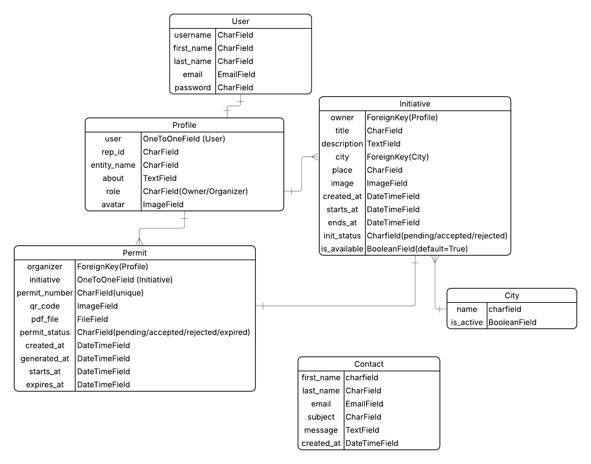

# Project Name:
Iftar Platform

# Project Description:
The Iftar Platform is a national digital system designed to regulate and streamline the process of organizing Iftar initiatives across different cities. It facilitates structured communication and collaboration between key stakeholders: the Organizer, Owner, and Admin (Government Authority).

The platform enables Owners to register and create Iftar initiatives, providing details of available locations and opportunities for hosting Iftar initiatives. They can also manage their profiles and monitor their submitted initiatives.
Organizers can browse available Iftar initiatives, view detailed information, and submit permit requests to host Iftar activities. They also have access to profile management features.

The Admin (Government Authority) oversees the entire system by reviewing incoming requests, evaluating submitted initiatives, and approving or rejecting them based on compliance and regulations. The admin is responsible for issuing official Iftar permits to approved organizers and ensuring that all activities align with national guidelines.

Overall, the Iftar Platform aims to enhance transparency, simplify permit procedures, and support community-driven Iftar initiatives in an organized and efficient manner.

# Features List
- User authentication and authorization with three distinct roles (Owner, Organizer, Government).
- Role selection landing page  sign-up and sign-in flows.
- Initiative creation and management for Owners.
- Browsing available Iftar initiatives for Organizers.
- Permit request system with approval workflow.
- Reviewing and processing incoming permit and initiative requests.
- PDF permit generation with QR code for verification.
- Time-limited permits.
- Filtering by: permit status, city and initiative status 
-  Browse profile for all roles.
- Contact form for user inquiries.
- Responsive design for mobile and desktop screens.
- Light and dark mode theming.
- Bootstrap 5 for modern UI components.

# User Stories
As an Owner:
- Create a new account (Sign Up).
- Log in to the platform (Sign In).
- Add a new Iftar initiative.
- Browse profile and my initiatives.

As an Organizer:
- Create a new account (Sign Up).
- Log in to the platform (Sign In).
- Browse available Iftar initiatives.
- Request a permit for a specific initiative.
- Browse profile and my permits.

As an Government (Admin):
- Browse incoming permit and initiative requests.
- Give (approve/reject) Iftar permits (incoming from Organizer).
- Give (approve/reject) Iftar initiative (incoming from Owner).

# UML

# Wireframe

